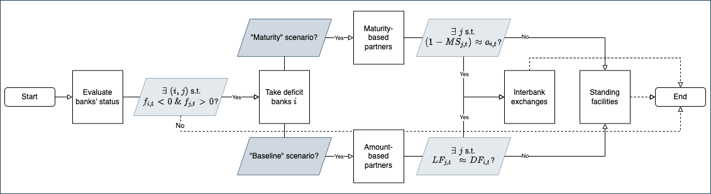

# Interbank Decisions and Margins of Stability: an Agent-Based Stock-Flow Consistent Approach

This repository contains the files to replicate the simulations of "Interbank Decisions and Margins of Stability: an Agent-Based Stock-Flow Consistent Approach" by Jessica Reale

To contact me: [Jessica Reale](mailto:jessica.reale@ruhr-uni-bochum.de)
## What you can find in this repository

The [`src`](src) folder contains the following elements:

1. the main module of this project [`IMS.jl`](src/IMS.jl) which includes:
    1. what happens at each simulation step (*model_step!* function);
    2. several model-based functions that update credit and interbank market matching and interbank interest rates.

2. the scripts to run the model:
    1. the script to execute the model without data saving nor parallel replications [`run.jl`](src/run.jl);
    2. the script to execute the model with parallelised replications and data saving [`run_complex.jl`](src/run_complex.jl).

3. the model characteristics within the [`model`](src/model) folder that includes:
    1. the model initialisation file [`init.jl`](src/model/init.jl);
    2. the set of exogenous parameters and corresponding value [`params.jl`](src/model/params.jl);
    3. the mutable structs of each agent type that defines properties and variables [`structs.jl`](src/model/structs.jl);
    4. some functions of general utility in [`utils.jl`](src/model/utils.jl) which also includes the Stock-Flow consistency checks performed at each simulation step;
    5. a folder [`SFC`](src/model/SFC) where all behavioural rules are defined for each class of agents/sectors:
        - banks: [`banks.jl`](src/model/SFC/banks.jl);
        - central bank: [`cb.jl`](src/model/SFC/cb.jl);
        - firms: [`firms.jl`](src/model/SFC/firms.jl);
        - government: [`gov.jl`](src/model/SFC/gov.jl);
        - households: [`hh.jl`](src/model/SFC/hh.jl).

4. the scripts to load the data collected and generate plots [`plots`](src/plots);

5. the scripts to run sensitivity analysis on parameter values and plot the results [`sensitivity-analysis`](src/sensitivity-analysis).

## Interbank matching mechanisms

## Simulations

We run the simulations over two scenarios (`scenario`) diversified by the interbank matching protocol. Each scenario is shocked with three experiments. The table below summarises the shocks we implement.

Shocks `shock`      | Variables                     | Step `shock_incr` 
-------------       | -------------                 | -------------
Missing-shock       | –                             | – 
Corridor-shock      | `icbl, icbd, icbt += 0.005`   | every 300 steps
Width-shock         | `icbl, icbt += 0.005`         | every 300 steps
Uncertainty-shock   | `PDU += 0.2`                  | every 300 steps

## Sensitivity analysis

We perform sensitivity tests on ten parameters:

Parameter           | Range                         | Description
-------------       | -------------                 | -------------
`model.r`           | {0.9, 1.1, 1.3}               | government debt-to-GDP ratio
`model.δ`           | {0.05, 0.5, 1.0}              | capital depreciation
`model.l`           | {0.03, 0.5, 1.0}              | share of non-performing loans 
`model.γ`           | {0.1, 0.5, 1.0}               | households’ leverage
`model.gd`          | {0.1, 0.5, 1.0}               | proportion of wages deposited
`model.m1`          | [0.0:0.1:1.0]                 | RSF risk factor on short-term loans
`model.m2`          | [0.0:0.1:1.0]                 | RSF risk factor on medium-term loans
`model.m3`          | [0.0:0.1:1.0]                 | RSF risk factor on long-term government bonds
`model.m4`          | [0.0:0.1:1.0]                 | ASF risk factor on deposits
`model.m5`          | [0.0:0.1:1.0]                 | ASF risk factor on term interbank loans
